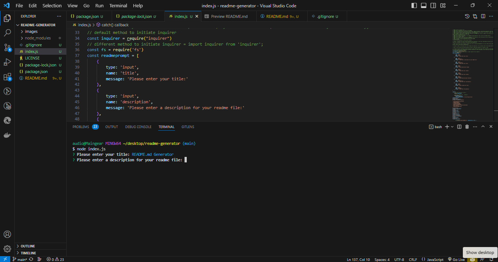

# <Your-Project-Title>
README Generator

## Description
This is a command-line application that dynamically generates a professional README.md file from a user's input using the Inquirer package. The application will be invoked with the following command: node index.js. The user will be prompted for their GitHub username and other information pertaining to the project the README is for. The README will be populated with the following:

## Table of Contents (Optional)
    
- [Installation](#installation)
- [Usage](#usage)
- [Credits](#credits)
- [License](#license)
- [Features](#features)
- [How to Contribute](#how-to-contribute)
- [Tests](#tests)
- [Questions](#questions)
- [Links](#links)
    
## Mock-Up
 

## Demo Video
[Demo Video](https://drive.google.com/inputyourfilehere)

## Installation
Installation instructions: npm install inquirer instructions can be found here, https://www.npmjs.com/package/inquirer. 

## Usage
You can use this application to generate a README.md file for your project.

## Credits
Credits: https://www.npmjs.com/package/inquirer

## License
MIT License

## Features
Features: This application features the Inquirer package and allows users to dynamically generate a README.md file for their project.

## How to Contribute
How to contribute: Please contact me via email if you would like to contribute to this project.

## Tests
Tests: No tests are included in this application. You may write your own tests if you wish.

## Questions
If you have any questions about the repo, open an issue or contact me directly at, precisionconsulting2@protonmail.com.

## Links
Link to README-GENERATOR repository on GitHub:
https://github.com/precisecoding/README-generator 